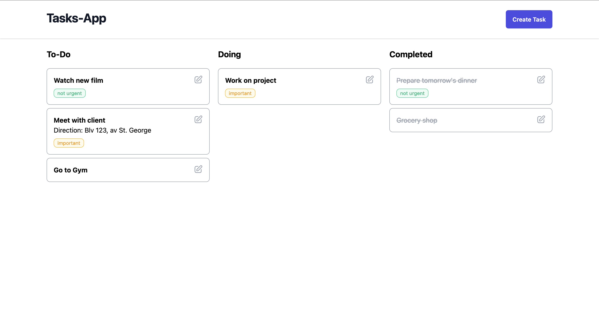

## To-Do App

I'm currently working on this app just to practice my new laravel skills by making simple apps.

Everything I'm doing in this projects is learnt from  - [Laracast YouTube channel.](https://www.youtube.com/watch?v=SqTdHCTWqks&t)

## About the App

This app is meant to be used as a productivity tool by letting the user create tasks and track their progress as *'pending'*, *'doing'* and *'completed'*.

## Tech Stack 
This app is built with Laravel, its data stored in SQLite database, and styled with Tailwind.css. 
